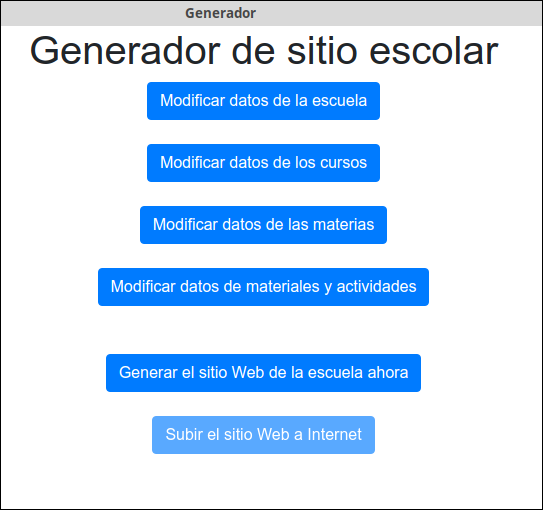
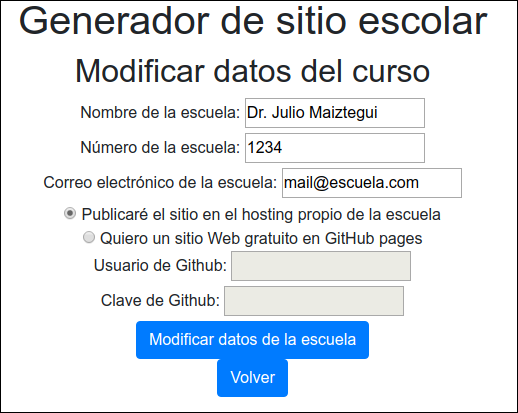
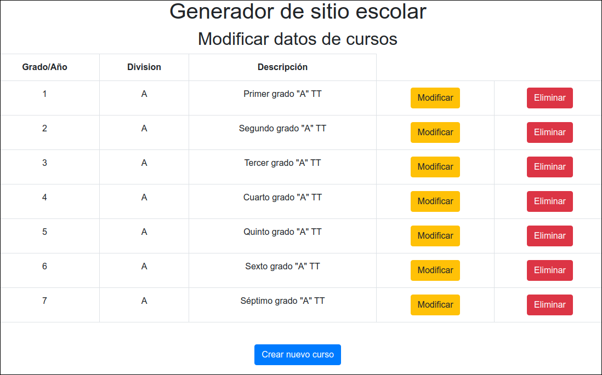
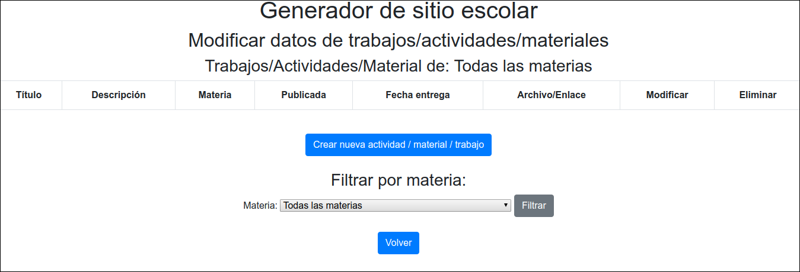
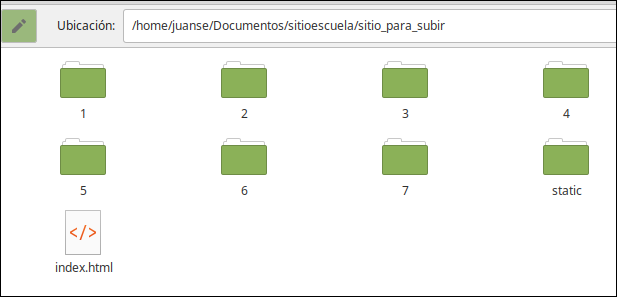
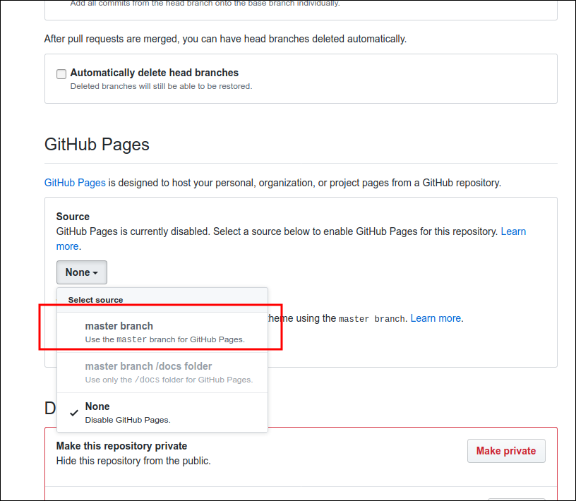

# Tutorial de instalación y uso
Gracias por utilizar este programa. Es una iniciativa muy modesta, pero creemos 
que puede ser útil en muchos casos. Si vos sos uno de esos casos, queremos agradecerte
de antemano, no solamente por usar nuestro **sitioescuela** (que es lo de menos), sino
principalmente por seguir enseñando, aún en estos tiempos difíciles. Gracias, de verdad.

Si al utilizar el programa ves algo que falla **nos sería de gran ayuda que nos avises**. 
No existen programas que no tengan errores. Fuimos cuidadosos para tratar de que 
no haya ninguno, pero seguro que algo se nos pasó.

**¿Apareció un error? ¿Hay algo que podría mejorar? ¡Avisános!** Podés 
escribirnos a sitioescuela@juansemarquez.com	

Basta de prólogos, y manos a la obra.

---
## 1- Instalación:

###  1a- Instalación en GNU/Linux
(Si usás Windows, leé [el próximo apartado](#1b). Si no usás Windows, mejor. 
:stuck_out_tongue_closed_eyes: )
* **Actualizar lista de paquetes:** En una terminal, ejecutar el comando 
`sudo apt update`
* **Prerrequisito: instalar python3** En la mayoría de las distros ya viene 
instalado, pero, por las dudas, abrí una terminal y escribí el comando 
`python3 -V` --> (letra "v" mayúscula).
    * Si la respuesta es `Python 3.X.Y`, donde `X` e `Y` son cualquier número, 
ya está instalado. 
    * Si no, escribí el comando: `sudo apt install python3`
* **Instalar pip3 y venv:** escribí el comando 
`sudo apt install python3-pip python3-venv`
* Descargá el archivo: [https://github.com/juansemarquez/sitioescuela/archive/master.zip](https://github.com/juansemarquez/sitioescuela/archive/master.zip), descomprimílo, e ingresá en la carpeta del programa:
    * lo podés hacer en modo gráfico, 
    * o con el comando: 
`wget https://github.com/juansemarquez/sitioescuela/archive/master.zip && 
 unzip master.zip && 
 cd sitioescuela-master` (todo en una sola línea)
* **Crear el entorno virtual:** Ejecutá el comando `python3 -m venv venv`
* **Activar el entorno virtual:** `. venv/bin/activate`
* Dentro del entorno virtual, ejecutar el comando: `pip3 install flask flask_wtf`
* Listo, el sistema ya se puede utilizar como se indica [a partir del punto 2](#2).

###  1b- Instalación en Windows
(Si usás GNU/Linux, leé [el apartado anterior](#1a))
* **Prerrequisito: Instalar Python 3:** Hay muchos tutoriales de cómo instalar
Python 3, [este, por ejemplo](https://python-para-impacientes.blogspot.com/2017/02/instalar-python-paso-paso.html)
    * Tiene que ser la versión 3.6 o superior. 
    * Es importante instalar pip (es una de las opciones del instalador, y ya viene parcada por defecto), 
    * y añadir Python al PATH (está explicado en el tutorial).
* Descargá el archivo: 
[https://github.com/juansemarquez/sitioescuela/archive/master.zip](https://github.com/juansemarquez/sitioescuela/archive/master.zip)
* Descomprimílo.
* Ingresá en la carpeta en donde está el programa, y ejecutá el archivo `instalar_windows.bat`
* Listo, el sistema ya se puede utilizar como se indica [a partir del punto 2](#2).

---

##  2- CRUD en Flask
Para iniciar el programa:
* **En GNU/Linux:** con el archivo `iniciar.sh`
* **En Windows:** con el archivo `iniciar_windows.bat`

Ahora que arrancó el programa, se va a abrir tu navegador Web, para que cargues 
los datos de tu escuela, cursos, materias, y actividades de cada materia.

Es un trabajo que toma su tiempo la primera vez, pero después se va haciendo 
cada vez más simple.

Al inicio, vas a ver una pantalla parecida a la siguiente:

---

### 2.1 Datos de la escuela
El primero de los botones, te permite cargar los datos de tu escuela:

Los campos llamados "Usuario de Github" y "Clave de Github", solamente tenés que 
completarlos si querés tener un sitio gratuito en Github Pages. Seguí leyendo, 
que [te lo explicamos más adelante](#4.2)

---

### 2.2 Datos de los cursos / grados
El segundo botón te permite cargar los datos de los cursos/grados/años/"comosellamen" de tu escuela.

Vas a ver que hay varios grados "precargados", eso lo hicimos nosotros, como 
para mostrar cómo queda.

Pero vos podés borrar/modificar lo que quieras. Eso sí: 

> :warning: Para poder **borrar** un curso/grado, tenés que asegurarte *antes* 
de que no tenga [materias](#2.3) cargadas

El botón que se ve al final, te permite ingresar un nuevo grado/curso.

---

### 2.3 Datos de las materias

El tercer botón te permite cargar los datos para las materias de cada curso.

> :warning: Para poder **borrar** una materia, tenés que asegurarte *antes* de 
que no tenga [trabajos](#2.4) cargados.

Si tenés muchos cursos y muchas materias en cada curso, se te va a hacer un poco 
de lío.

Por eso, al final de la lista, tenés la posibilidad de *filtrar*, es decir, ver 
solamente las materias de un solo curso/grado:

---

Pulsando en el botón para cargar una nueva materia, tenés que cargar los datos 
de la nueva asignatura:

* Nombre de la materia
* Curso / Grado
* Nombre del docente
* Email del docente
* ¿Siempre arriba? (Si está seleccionado, esta materia figurará siempre al 
principio de la lista de materias de ese grado / curso. Puede ser útil para 
notas de dirección, actividades interdisciplinarias, etc.)
* Logo: Para elegir el *logo* de la materia, hay que buscar una de las imágenes 
de la carpeta `static/logos`, tal como se muestra en la imagen:

---

### 2.4 Datos de los trabajos/actividades
El cuarto botón te permite cargar los trabajos / actividades / materiales para cada una de las materias.

Si tenés muchos cursos, con muchas materias, con muchos trabajos cada una... 
enseguida te podés perder.

Al final de la lista, vas a encontrar una herramienta para *filtrar*, de manera 
que puedas ver solamente los trabajos de una cierta materia.

---

Pulsando en el botón para cargar un nuevo trabajo / actividad, vas a tener que 
cargar los datos del trabajo:

* Título para el trabajo/actividad
* Descripción breve del trabajo/actividad
* Materia a la que pertenece el trabajo / actividad
* Fecha de publicación
* Si el trabajo tendrá una fecha de entrega (si es así, nos pedirá dicha fecha)
* Una de las siguientes opciones:
    * Nombre de la URL (dirección Web) donde está el trabajo, o bien:
    * Nombre del archivo (pdf, jpg, mp3, etc) con los datos del trabajo, que se subirá a la página.
---

## 3. Generar el sitio Web
En la pantalla inicial, el quinto botón nos permite generar el sitio Web.

Simplemente pulsamos el botón, y esperamos que nos muestre el mensaje de que 
**el sitio se ha generado con éxito**.

Si volvemos a la carpeta donde está nuestro programa, veremos una subcarpeta 
llamada `sitio_para_subir`. Adentro de esa carpeta está... el sitio para subir, 
obviamente.

Si querés ver cómo va a quedar el sitio, podés hacer doble-clic en el archivo `index.html`.

---

## 4. Subir el sitio a la Web

### 4.1 Con hosting propio

Si la escuela tiene hosting propio, podés subirlo con tu cliente favorito 
(como *Filezilla*, por ejemplo).

Si no, seguí leyendo que te explicamos cómo conseguir un hosting gratuito.

### 4.2 En GitHub Pages (gratis)

Antes de poder subir un sitio a GitHub Pages, vas a tener que crearte una cuenta 
en GitHub.com

#### 4.2.1 Instalar git

Tenés que tener instalado `git` en tu máquina.

Si usás GNU/Linux (Ubuntu/Debian/Mint/etc), podés ejecutar el comando:
`sudo apt install git`

Si usás Windows :roll_eyes:, podés descargar git gratuitamente e instalarlo. 
Hay muchos tutoriales en la Web que lo explican muy bien, 
[este por ejemplo](https://myhanoli.com/2018/08/25/5-pasos-para-instalar-git-en-windows/).

#### 4.2.2 Crear una cuenta en GitHub
Ingresá en https://github.com, y creá una nueva cuenta. Tenés que usar un mail 
real, al que tengas acceso.

:warning: **Tené en cuenta que el nombre de usuario que elijas, va a ser la dirección 
donde tus alumnos accedan a la página de la escuela**

Completá el captcha, y algunas otras preguntas que te hace GitHub. 

Revisá tu mail, para que te llegue la activación.

Cuando nos diga que el mail se ha verificado, elegimos crear un nuevo repositorio.

> :warning: **El nombre que elijas para el repositorio debe ser: `tu-nombre-de-usuario.github.io`**

Ahora, en la app, tenés que ingresar al primero de los botones, el que tiene los 
datos de la escuela, y cargar los datos de GitHub:

A continuación, hay que ir a una terminal (en GNU/Linux) o a Git bash (en 
Windows), y **ejecutar *por única vez* un archivo que se llama `publicador.sh`**,
desde una terminal (o git bash, si estás en windows), del siguiente modo:
`./publicador.sh tu-usuario-de-github tu-clave-de-github tu-email`

Por último, en Github, debemos configurar las Pages, haciendo clic en Settings...

... y en el apartado GitHub Pages, elegimos "master branch":

**¡Listo!** Ahora, cada vez que volvamos a generar el sitio cuando haya algún 
cambio, *podemos volver a publicarlo automáticamente, pulsando el último de los 
botones* de la aplicación.

---

## 5. Hacer backups

Estuviste trabajando un rato largo, muchos cursos, materias y trabajos para cargar...

Sería un garrón que tanto trabajo se perdiera.

Para hacer un backup tenés que guardar **en un lugar seguro, y en otra máquina**:

* El archivo `bd.sqlite`
* La carpeta `material`

### 5.1 Recuperar mi trabajo a partir de un backup.

Supongamos que "te mudás" a otra computadora. Entonces, volvés a descargar el 
programa, como se indica [al principio](#1a), y reemplazás el archivo `bd.sqlite` 
que descargaste por el que habías guardado en tu backup.
Además, tenés que copiar todo lo que hay en la carpeta `material` de tu backup a 
la carpeta `material` de la nueva instalación.

Y listo, el programa está tal cual lo habías dejado la última vez.

